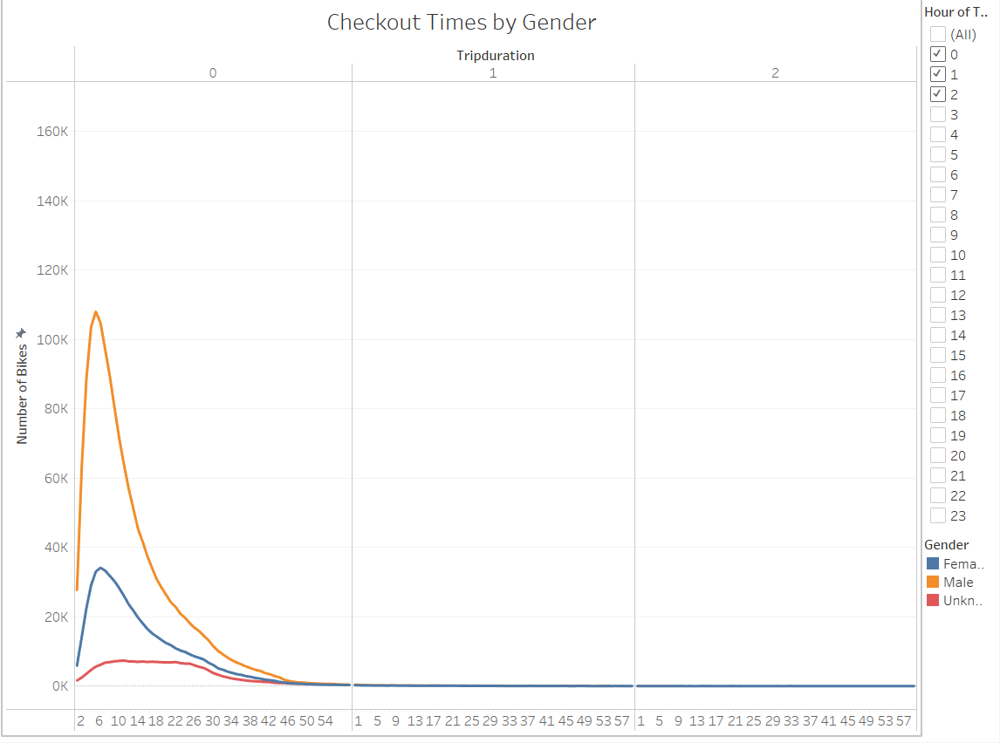
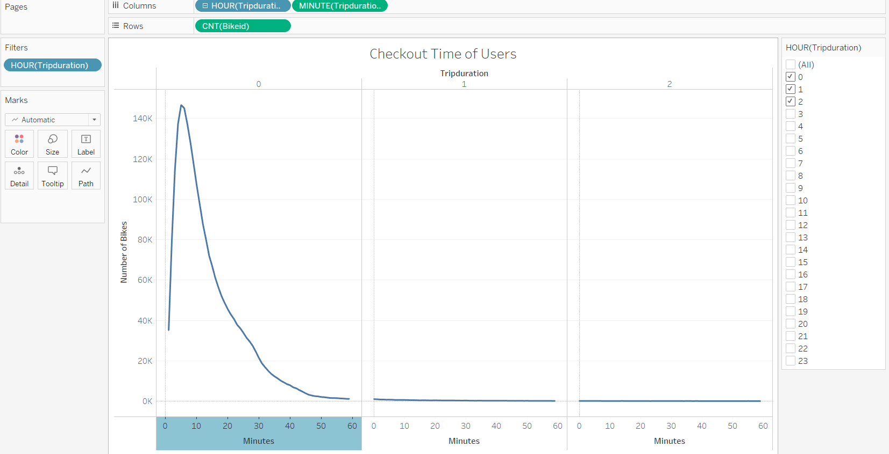
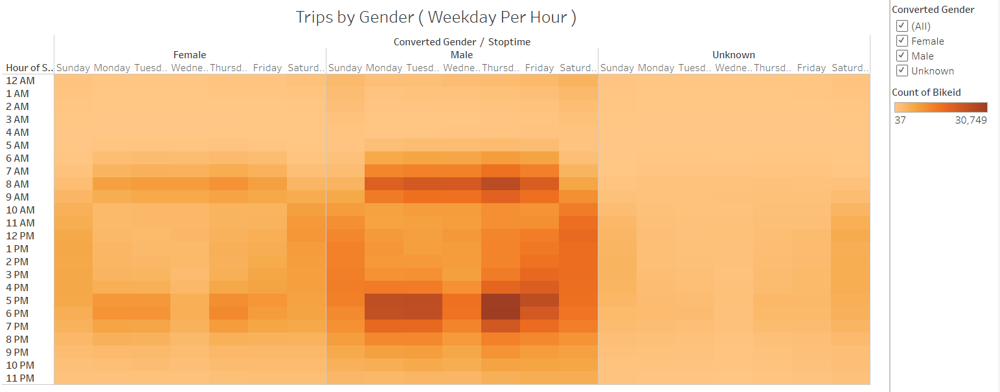
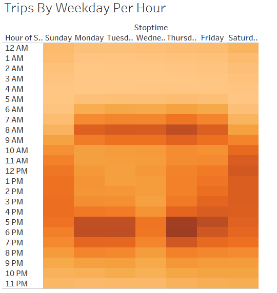
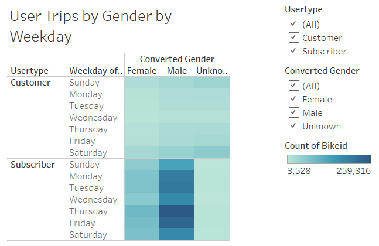

# Bikesharing
## Introduction
**This project aims to visualize bike-sharing data in Tableau.**This project segregated the information into five different categories which were checkout times for users, checkout times by gender, trips by weekday per hour, trips by gender (week day per hour), and user trips by gender per week day. Data for this vitalization came from a CSV which holds cleaned and sorted information from a larger CSV.
## Results
Link to Tableau public: https://public.tableau.com/app/profile/anjali.skilton/viz/askilton_bikesharing/Story1
### Images of Vitalization

## Summary
Top findings are as follows:
1)	Most users use the bike for less than an hour.
2)	Most users are male.
3)	Most rides happen around 5pm to 6pm on Thursdays, followed by Monday and Tuesday.
